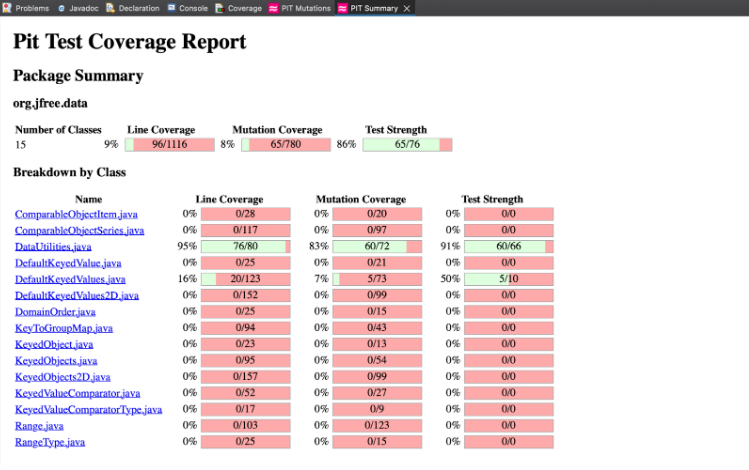
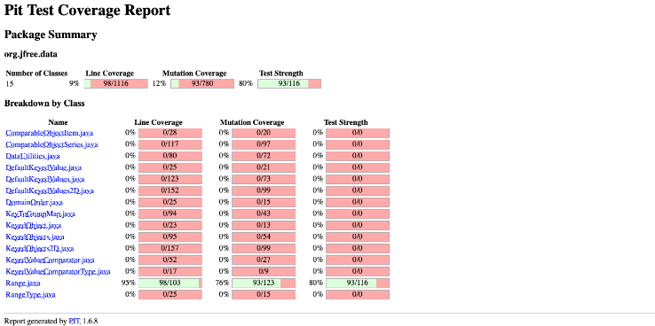
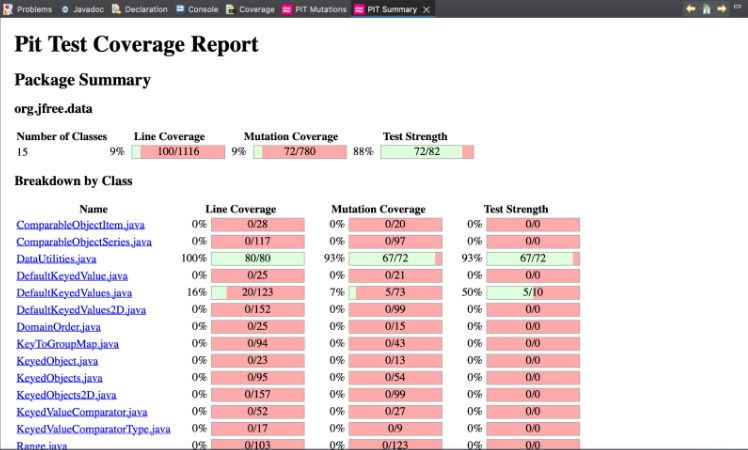
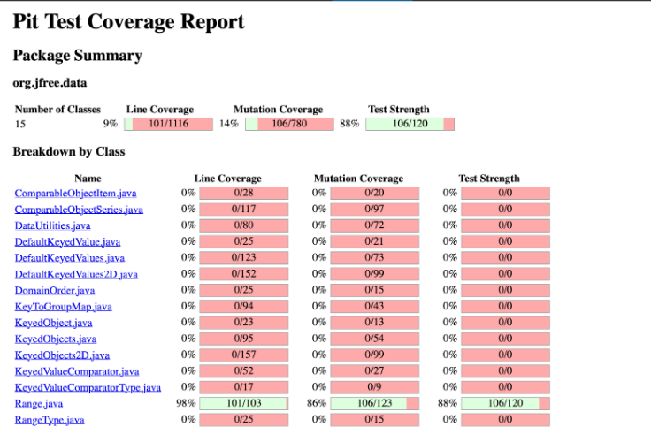
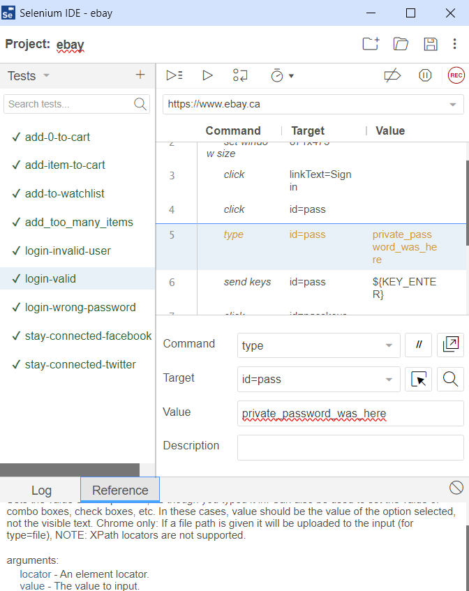
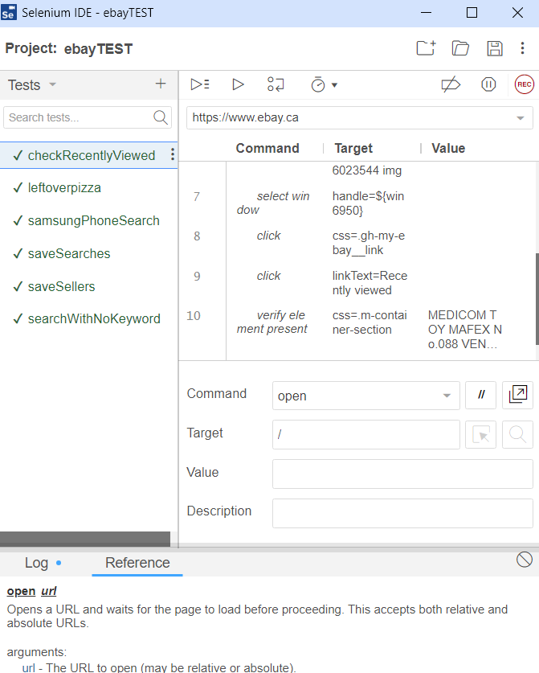

**SENG 438 - Software Testing, Reliability, and Quality**

**Lab. Report \#4 – Mutation Testing and Web app testing**

| Group \#:                  | 13  |
| -------------------------- | --- |
| Student Names:             |     |
| Md Rafid Mohtasim Bin Saif |     |
| Noshin Nawar               |     |
| Jacob Koep                 |     |
| Minseung Kwon              |     |

# Introduction

Getting ourselves to use mutation testing with pi-test and using the Selenium IDE tool was the main focus of this lab assignment,as to get ourselves familiarised with the concepts introduced in our lectures. Our mutation testing tool, pi-test enabled us to go through the mutation coverage of our code in Eclipse. For Part 2, we used the Selenium IDE extension on our chrome and firefox web browsers for automated testing of functionalities in ebay.ca. Additionally, the purpose of mutation testing was to guarantee that the original source code from assignment 3 had a high error detection, and if not write the test cases written to catch mutations of the code which were not tested properly and increase mutation coverage by 10 percent compared to the source code in assignment3 was our goal. In GUI testing, we gained an understanding of how to automate test cases with selenium IDE based on user interface that lets users record and execute their scripts, while also being able to add verification points for confirmation of functionalities.

# Analysis of 10 Mutants of the Range class

1. Double getCentralValue()

Mutation: Replaced double division with multiplication (Killed)

In this situation, the mutation involved replacing the division operators in this.lower / 2.0 + this.upper / 2.0 with multiplication. This alteration was promptly identified by the test cases because altering the mathematical approach to determine the central value would inevitably lead to an inaccurate result. Substituting divisions with multiplications resulted in erroneous behaviour, promptly flagged by the tests.

2. intersects(double b0, double b1)

Mutation: Changed conditional boundary (Survived)

This mutation managed to slip through undetected because our initial test suite failed to cover scenarios where the intersects(double b0, double b1) method is invoked with specific parameter values. Specifically, it overlooked cases where b0 equaled the upper bound of the Range object under examination or where b1 equaled the lower bound. To eliminate this mutation and thoroughly test the boundaries, we devised two additional test cases. In the first case, we instantiated a Range object spanning from 2 to 6, with b0 set to 6. In the second case, we crafted a Range object covering the range from 2 to 6, with b1 set to 2.

3. expandToInclude(Range range, double value)

Mutation: Replaced return value with null (Killed)

In this mutation, the line "return new Range(value, value)" was substituted with "return null". The test cases expandToIncludeNullLower and expandToIncludeNullUpper were designed to account for this change, expecting the code to yield a non-null range passed in as the "value" argument. Consequently, when the mutation returns null, as in this scenario, the test case fails, which is the expected outcome.

4. hashCode()

Mutation: Replaced integer addition with subtraction

During mutation testing, a mutant survived by replacing integer addition with subtraction in the hashCode() method. This mutation likely remained undetected because it did not significantly alter the resulting hash value due to the commutative property of addition and subtraction. The mutant successfully maintained the essential structure of the hash code calculation while subtly changing the arithmetic operation. Additionally, the resulting hash code might not have clashed with existing hash codes, reducing the chance of detection. Thus, the mutant evaded detection by exploiting the tolerance of the hash code generation process to minor arithmetic variations.

5. hashCode()

Mutation: Replaced unsigned shift right with shift left

In the same line of the method, another mutant survived by replacing unsigned shift right with shift left in the hashCode() method. This mutation potentially went unnoticed due to the similarity in bitwise operations and their potential effect on the resulting hash value. Both operations involve shifting bits, which might not dramatically alter the hash code's final value. The mutant likely preserved the essential characteristics of the hash code computation while subtly adjusting the bitwise operation. Moreover, the resulting hash code might not have collided with existing hash codes, diminishing the likelihood of detection. Consequently, the mutant managed to evade detection by exploiting the hash code generation process's leniency towards minor bitwise variations.

6. shiftsWithNoZeroCrossing()

Mutation: Replaced double return with 0.0d

The mutant "Replaced double return with 0.0d" was successfully killed due to the nature of the shiftWithNoZeroCrossing() method and its intended functionality. This method is designed to adjust a given value by a specified delta while ensuring that the result does not cross the threshold of 0.0. The mutant's replacement of the return statement with 0.0d would force the method to always return 0.0, regardless of the input values, thus defeating the purpose of the method. Consequently, during testing, it would likely have been detected that the mutant's behavior deviated significantly from the expected behavior of the method, leading to its termination.

7. scale(Range base, double factor)

Mutation: negated conditional

The mutant "negated conditional" was successfully killed because it attempted to negate the condition checking for a negative factor in the scale() method. The original condition ensures that the factor must be non-negative, which is a critical requirement for scaling a range. By negating this condition, the mutant would allow negative factors, leading to incorrect scaling behaviour and potentially producing invalid ranges. Consequently, during testing, it was detected that the mutant's alteration introduced a violation of the method's precondition, leading to its termination and ensuring that only valid scaling factors are accepted.

8. equals(Object obj)

Mutation: replaced boolean return with true

The mutant "replaced boolean return with true" got killed because it always returned true, disregarding the actual object comparison logic. This modification made the equals() method incorrectly report equality for all objects. The tests identified this deviation from expected behaviour, ensuring that the method properly distinguishes between different Range objects based on their bounds.

9. isNanRange()

Mutation: replaced boolean return with false

The killed mutant, which replaced the boolean return with false, was effectively terminated because it negated the logic of the isNaNRange() method. This alteration would have caused the method to erroneously return false for cases where both the lower and upper bounds are Double.NaN, which is contrary to the method's intended purpose. Consequently, the tests successfully identified this deviation from expected behaviour, ensuring that the method accurately determines whether both bounds are Double.NaN.

10. expandToInclude(Range range, double value)

Mutation: changed conditional boundary

The mutant "changed conditional boundary" survived in the else if line because it altered the conditional boundary without affecting the overall logic of the method. In the original implementation, the else if condition checks if the specified value is greater than the upper bound of the range. By changing the conditional boundary, the mutant potentially broadened the range in which the condition would evaluate to true. However, since the original else if condition and the mutant's altered condition both aim to handle cases where the value exceeds the range's upper bound, the mutant's change did not fundamentally disrupt the method's functionality. Consequently, the mutated method remained valid and survived without causing test failures.

# Report all the statistics and the mutation score for each test class

DataUtilities Original Mutation Coverage(83%):  

Range Original Mutation Coverage(76%):  

Test cases added in DataUtilitiesTest file:

1. testFirstNull

Description: Checks if the equal method correctly handles the case where the first input array is null.
Mutation Coverage: Tests for mutations in the null check (a == null) within the equal method. If mutated (e.g., to a != null), the test should fail, indicating the mutation is covered.

2. testSecondNull

Description: Checks if the equal method correctly handles the case where the second input array is null.
Mutation Coverage: Tests for mutations in the null check (b == null) within the equal method. Similar to testFirstNull, a failing test would indicate coverage.

3. testBothNull

Description: Verifies if the equal method returns true when both input arrays are null.
Mutation Coverage: Tests for mutations in the logic that handles both null arrays. If mutated (e.g., to return false), the test should fail, signifying coverage.

4. testInequality

Description: Ensures the equal method identifies inequality when the arrays have different content.
Mutation Coverage: Tests for mutations in the array comparison logic (Arrays.equals(a[i], b[i])). Mutations in comparison operators or loop conditions could be uncovered.

5. testDifferentLength

Description: Verifies the equal method detects inequality when the arrays have different lengths.
Mutation Coverage: Tests for mutations in the loop condition (i < a.length) or the array access logic. Mutations might lead to out-of-bounds exceptions or incorrect comparisons.

6. testDoubleArrNull

Description: Confirms that the clone method returns a non-null copy for a non-null input array.
Mutation Coverage: Tests for mutations in the null check (source != null) or the array copying logic within clone. If mutated, the test might pass with an unexpected null value, indicating coverage.

7. testNumberArray2DCreation_MixedNumbers

Description: Tests if the createNumberArray2D method correctly handles a 2D array with mixed positive and negative numbers.
Mutation Coverage: Tests for mutations in the array creation or conversion logic. Mutations might lead to unexpected data types or array structures.

8. testNumberArrayCreation_MixedNumbers

Description: Verifies if the createNumberArray method creates a Number array with mixed positive and negative numbers from a double array.
Mutation Coverage: Tests for mutations in the conversion logic from double to Number objects. Mutations could introduce incorrect data types in the resulting array.

9. testNumberArray2DCreation_NonNullArray

Description: Checks if the createNumberArray2D method returns a non-null array for a non-null input array.
Mutation Coverage: Tests for mutations in the null check (source != null) or the array creation logic within createNumberArray2D. Similar to testDoubleArrNull, coverage is indicated by a failing test with an unexpected null value.

Test cases added in RangeTest file:

1. testBothBoundsNegative:

Description: Tests the calculation of the central value for a range where both bounds are negative.
Mutation coverage: This test case increases mutation coverage by ensuring that the calculation of the central value is correct for negative range bounds.

2. testBothBoundsPositive:

Description: Validates the calculation of the central value for a range where both bounds are positive.
Mutation coverage: Enhances mutation coverage by verifying that the central value is correctly computed for positive range bounds. 3. testOneBoundZero:

Description: Tests the central value calculation for ranges with one bound at zero, covering both negative and positive ranges.
Mutation coverage: Increases mutation coverage by confirming the accuracy of central value calculation for ranges that include zero.

4. testBothBoundsZero:

Description: Validates the central value calculation for a range where both bounds are zero.
Mutation coverage: Improves mutation coverage by verifying the correct calculation of the central value for ranges bounded at zero.

5. testCombine_BothRangesNull:

Description: Tests the behavior of the combine method when both ranges are null.
Mutation coverage: This test increases mutation coverage by ensuring the correct handling of null ranges in the combine method.

6. testCombine_Range1Null_Range2NotNull:

Description: Checks the behavior of the combine method when one range is null and the other is not.
Mutation coverage: Enhances mutation coverage by verifying the correct combination of null and non-null ranges in the combine method.

7. testCombine_Range1NotNull_Range2Null:

Description: Validates the behavior of the combine method when one range is not null and the other is null.
Mutation coverage: Increases mutation coverage by ensuring proper handling of null and non-null ranges in the combine method.

8.testCombine_BothRangesNotNull:

Description: Tests the combine method when both ranges are not null.
Mutation coverage: Enhances mutation coverage by verifying the correct combination of non-null ranges in the combine method.

9. testHashCode_DifferentRanges:

Description: Validates the hash code generation for different range instances, including equal and unequal ranges.
Mutation coverage: Increases mutation coverage by ensuring that hash codes are correctly generated for different range instances, covering both equality and inequality scenarios.

10. testMin_BothNaN:

Description: Tests the behavior of the min method when both input values are NaN.
Mutation coverage: This test increases mutation coverage by ensuring that the min method correctly handles scenarios where both input values are NaN.

11. testMin_FirstNaN:

Description: Validates the behavior of the min method when the first input value is NaN.
Mutation coverage: Enhances mutation coverage by verifying the correct behavior of the min method when one input value is NaN.

12. testMin_SecondNaN:

Description: Checks the behavior of the min method when the second input value is NaN.
Mutation coverage: Increases mutation coverage by ensuring proper handling of NaN values in the second argument of the min method.

13. testMin_NeitherNaN_FirstSmaller:

Description: Tests the min method when neither input value is NaN, and the first value is smaller.
Mutation coverage: This test case increases mutation coverage by validating the correct behavior of the min method when both input values are numbers, and the first value is smaller than the second.

14. testMin_NeitherNaN_SecondSmaller:

Description: Validates the min method when neither input value is NaN, and the second value is smaller.
Mutation coverage: Enhances mutation coverage by verifying the correct behavior of the min method when both input values are numbers, and the second value is smaller than the first.

15. testMin_NeitherNaN_Equal:

Description: Tests the min method when neither input value is NaN, and both values are equal.
Mutation coverage: Increases mutation coverage by ensuring proper handling of scenarios where both input values are numbers and are equal for the min method.

16. testMax_BothNaN:

Description: Checks the behavior of the max method when both input values are NaN.
Mutation coverage: This test increases mutation coverage by validating the correct handling of NaN values in both arguments of the max method.

17. testMax_FirstNaN:

Description: Validates the behavior of the max method when the first input value is NaN.
Mutation coverage: Enhances mutation coverage by verifying the correct behavior of the max method when one input value is NaN.

18. testMax_SecondNaN:

Description: Tests the max method when the second input value is NaN.
Mutation coverage: Increases mutation coverage by ensuring proper handling of NaN values in the second argument of the max method.

19. testMax_NeitherNaN_FirstSmaller:

Description: Checks the max method when neither input value is NaN, and the first value is smaller.
Mutation coverage: This test case increases mutation coverage by validating the correct behavior of the max method when both input values are numbers, and the first value is smaller than the second.

20. testMax_NeitherNaN_SecondSmaller:

Description: Tests the max method when neither input value is NaN, and the second value is smaller.
Mutation coverage: Enhances mutation coverage by verifying the correct behavior of the max method when both input values are numbers, and the second value is smaller than the first.

21. testMax_NeitherNaN_Equal:

Description: Validates the max method when neither input value is NaN, and both values are equal.
Mutation coverage: Increases mutation coverage by ensuring proper handling of scenarios where both input values are numbers and are equal for the max method.

22. testShiftWithNoZeroCrossing_PositiveValue_PositiveDelta:

Description: Tests shifting a positive value by a positive delta without allowing zero crossing.
Mutation coverage: This test case increases mutation coverage by ensuring that positive values are correctly shifted by positive deltas without crossing zero.

23. testShiftWithNoZeroCrossing_PositiveValue_NegativeDelta:

Description: Validates shifting a positive value by a negative delta without allowing zero crossing.
Mutation coverage: Enhances mutation coverage by verifying the correct behavior of shifting positive values by negative deltas without crossing zero.

24. testShiftWithNoZeroCrossing_PositiveValue_ZeroDelta:

Description: Tests shifting a positive value by a zero delta without allowing zero crossing.
Mutation coverage: Increases mutation coverage by ensuring the correct behavior of shifting positive values by zero deltas without crossing zero.

25.testShiftWithNoZeroCrossing_NegativeValue_PositiveDelta:

Description: Validates shifting a negative value by a positive delta without allowing zero crossing.
Mutation coverage: This test increases mutation coverage by verifying the accurate behavior of shifting negative values by positive deltas without crossing zero.

26. testShiftWithNoZeroCrossing_NegativeValue_NegativeDelta:

Description: Tests shifting a negative value by a negative delta without allowing zero crossing.
Mutation coverage: Enhances mutation coverage by ensuring the correct behavior of shifting negative values by negative deltas without crossing zero.

27. testShiftWithNoZeroCrossing_NegativeValue_ZeroDelta:

Description: Checks shifting a negative value by a zero delta without allowing zero crossing.
Mutation coverage: Increases mutation coverage by verifying the proper behavior of shifting negative values by zero deltas without crossing zero.

28. testShiftWithNoZeroCrossing_ZeroValue_PositiveDelta:

Description: Tests shifting a zero value by a positive delta without allowing zero crossing.
Mutation coverage: This test increases mutation coverage by ensuring the correct behavior of shifting zero values by positive deltas without crossing zero.

29. testShiftWithNoZeroCrossing_ZeroValue_NegativeDelta:

Description: Validates shifting a zero value by a negative delta without allowing zero crossing.
Mutation coverage: Enhances mutation coverage by verifying the accurate behavior of shifting zero values by negative deltas without crossing zero.

30. testShiftWithNoZeroCrossing_ZeroValue_ZeroDelta:

Description: Checks shifting a zero value by a zero delta without allowing zero crossing.
Mutation coverage: Increases mutation coverage by ensuring the proper behavior of shifting zero values by zero deltas without crossing zero.

!!CHANGE OF SOURCE CODE!!

CHANGED THE VISIBILITY OF MIN AND MAX TO PUBLIC
CHANGED THE VISIBILITY OF shiftWithNoZeroCrossing TO PUBLIC

# Analysis drawn on the effectiveness of each of the test classes

DataUtilities New Mutation Coverage(93%):  

The Mutation coverage increased by 10% from 83% to 93% which was the required margin of increase. We were able to kill 73 mutants and 10 more still survived. As the mutation score went up it got harder to track down mutants to kill. Overall, I believe our tests are comprehensive and can be accepted as the required test set to measure the reliability of the software.

Range New Mutation coverage(86%):  

We were able to increase the mutation coverage from 76% to 86% which shows an increase of 10%. We killed 107 mutants while a mere 14 survived. Our test set can be deemed successful and can be a metric to measure the reliability of this software.

# A discussion on the effect of equivalent mutants on mutation score accuracy

In mutation testing, a key concept is the distinction between killed mutants, which produce different outputs than the original program when subjected to the same test case, and surviving mutants, which maintain the same behavior. The accuracy of the mutation score, which measures the effectiveness of the test suite, can be affected by the presence of equivalent mutants. These mutants behave identically to the original program and are not detected by the test suite, leading to an inaccurate representation of the mutation score. Therefore, accurately assessing the mutation score requires considering the presence of equivalent mutants and their impact on the test suite's ability to reveal faults.

# A discussion of what could have been done to improve the mutation score of the test suites

In case of DataUtilities.java, we already had a pretty good mutation coverage of 83% which was later increased to 93%. The objective was to add more boundary conditions and here we specifically added test cases for untested methods in our previous assignment and tested out various conditions. Already achieving a near-perfect score for this class, there wasn’t a lot more to improve upon in the mutation coverage aspect without drastically changing the source code.

To enhance the mutation score for Range.java, additional tests were introduced to target various types of mutants, including those related to boundary conditions and increment/decrement operators. The focus was particularly on conditional statements, as these areas generated a significant number of mutants. The strategy involved combining multiple statement checks to maximize the chances of killing mutants and ultimately boosting the PIT mutation coverage score in the summary section.

# Why do we need mutation testing? Advantages and disadvantages of mutation testing

Mutation testing serves as a vital component in the Software Development Life Cycle, providing an indispensable layer of validation for test suites. By injecting mutated versions of the source code, it exposes potential blind spots in test coverage, thereby bolstering the robustness of the testing process. This approach ensures that bugs which may have slipped through traditional unit tests are identified, leading to higher confidence in the reliability of the software.

However, while mutation testing offers substantial benefits in terms of comprehensive test validation and bug detection, it also presents certain challenges. Particularly in larger codebases, the proliferation of mutants can overwhelm test developers, making it difficult to discern the purpose of each mutation. Moreover, the analysis of surviving mutants can be resource-intensive and time-consuming, potentially straining budgets and project timelines. Despite these drawbacks, the invaluable insights provided by mutation testing contribute significantly to enhancing code quality and minimizing software faults.

# Explain your SELENUIM test case design process

**Recently Viewed**  
We created 1 test case to test the Recently Viewed function: if the specific toy I have looked into is in the recently viewed section. The steps for test case is:

checkRecentlyViewed:

- In search box type: ‘toy’
- Click search
- Click on product MEDICOM TOY MAFEX No.088 VENOM COMIC Ver. Figure Spider-Man
- Click My ebay on upper top corner
- Click Recently Viewed
- Verify the element is present by comparing MEDICOM TOY MAFEX No.088 VENOM COMIC Ver. Figure Spider-Man < this product exists in my recently viewed section

**Search**  
We created 3 test cases to test the Search function: search with an invalid product that does not exist(leftover pizza), search valid products that exist(samsung phones), search with no keyword. The steps for each test case are:

leftoverpizza:

- In search box type: ‘leftover pizza’’
- Click search
- Assert that that such product does not exist with assert not text
- Scroll down the page to check if it's right

samsungPhoneSearch:

- In search box type: ‘samsung phone’’
- Click search
- Verify that the element exists with the search results header samsung phone with verify element present
- Scroll down the page to check if it's right

searchWithNoKeyword:

- Make sure search box has empty field in it
- Click search
- Scroll down the page

**Save Search**  
We created 1 test case to test the save search function: save searches for toy. The steps for each test case are:

saveSearches:

- In search box type: ‘toy’’
- Click search
- Click on save search with heart symbol
- Click on MyEbay
- Click on saved searches
- Verify that ‘toy’ is present in saved searches with verify element present

**Save Seller**  
We created 1 test case to test the save seller function: save seller for specific toy. The steps for each test case are:

saveSeller:

- In search box type: ‘toy’’
- Click search
- Click on New 2024 Smiling Critters Catnap Figure Plush Doll Hoppy Hopscotch gift Toy
- Click on save seller on the right side of the website
- Click on MyEbay
- Click on saved seller
- Verify that element is present by confirming the seller ‘storemal1’ is existing in saved sellers through verify element present

**Login**  
We created 3 test cases to test the login function: login with an invalid user that does not exist, login with a user that does exist but with the wrong password, and a valid login. The steps for each test case are:

Invalid User:

- Click sign in
- Click change user
- Enter invalid user (fake@wrongemail.com) to the username field
- Click continue
- Verify that the element with the sign in error message is present

Wrong Password:

- Click sign in
- Enter wrong password (wrong)
- Click sign in
- Verify that the element with the sign in error message is present

Valid Login:

- Click sign in
- Enter the correct password
- Verify that the element with the welcome message is present

**Add to watchlist**

- We only created one test case for this since there is only one way to use this functionality, by clicking the add to watchlist button. Here are \* the steps for our test case:
- Choose an item on ebay
- Click add to watchlist
- Click button to view your watchlist
- Verify that the item is in the watchlist

**Add to cart**  
We created 3 test cases for this functionality: add 0 items, add too many items, and add properly. Here are the steps for each test case:

Add 0 items:

- Choose an item on ebay
- Type in 0 for the quantity
- Try to add to cart
- Verify that the element with the error message is present
- Add too many items:
- Choose an item on ebay that has less than 10 items available
- Type in 10 for the quantity
- Try to add to cart
- Verify that the element with the error message is present
- Add Properly:
- Choose an item on ebay
- Click add to cart (with the default quantity of 1)
- Go to view your cart
- Verify that the item is in your cart

**Stay Connected**  
There are 2 stay connected buttons on the website, one for twitter and one for facebook, so we created a test case for each. Here are the steps for each test case:

Facebook:

- Click the facebook stay connected button
- Verify that the element with the facebook logo is present

Twitter:

- Click the twitter stay connected button
- Verify that the element with the twitter logo is present

# Explain the use of assertions and checkpoints

We used assertions to verify that the test cases pass. To test any functionality, we went through the steps to use it, and then used an assertion to verify that an element is present which would only be present if the test case passed. For example, for the login with invalid user test case, we tried to login with a user that does not exist and then we used an assertion to verify that the element with the message “We couldn't find this eBay account.” is present.

# how did you test each functionaity with different test data

**Login:**  
We tested 3 situations with different test data for this function: one with an invalid username, one with an invalid password, and one with a correct username and password. This allowed us to test valid and invalid cases for the two input parameters: the username and the password.

**Add to watchlist:**  
Since there is no input to this button, we only created one test case to make sure that it works properly.

**Add to cart:**  
We changed the quantity for each test case used here. For one test case we chose 0 items, for another we chose 10 items (on an item with less than 10 available), and for the final one we chose 1 item. This allowed us to test the lower bound, a nominal value, and a value above the upper bound.

**Stay Connected:**  
Since there are no inputs to these buttons, we only tested that each of them work, but there is no input data we can change.

**Recently Viewed:**  
There is no possible input change for recently viewed, as it could be added more or less on whichever products the customers have seen, but there are no scenarios of an invalid input for this functionality to be tested of..

**Search:**  
We categorised the possible inputs as invalid input(leftover pizza), valid input(samsung phone), valid input but wouldn't show specific products(search with no keyword). This allowed us to test possible inputs that the customers might put in when using the search function in ebay.ca

**Save searches:**  
There is no possible input change for save searches, as it could be added more or less on whichever searches the customers have saved, but there are no scenarios of an invalid input for this functionality to be tested of.

**Save sellers:**  
There is no possible input change for save sellers, as it could be added more or less on whichever sellers the customers have saved, but there are no scenarios of an invalid input for this functionality to be tested of.
Note: save searches/save sellers works when currently the searches/sellers are as ‘unsaved state’ so if we run the test twice, the searches/sellers would start as saved state then it wont pass the verification test. So we have to make sure to begin the test, the search and seller we want to test is not saved

# Discuss advantages and disadvantages of Selenium vs. Sikulix

We found that Selenium was a lot more intuitive to use. Because of this, we were able to develop test cases much faster than we had with Sikulix. However, the ability to write test cases that look more like normal code in Sikulix would definitely be a big advantage if we had been more familiar with the system. Overall, Selenium was great for us and would be good for any beginners, but once you are more familiar with Sikulix it might be a better tool to use.

# How the team work/effort was divided and managed

Jacob and Minseung both had trouble getting mutation testing working, so we decided that Noshin and Rafid would cover the mutation testing, and Jacob and Minseung would cover the GUI testing. Noshin and Rafid did the entire mutation testing process collaboratively and worked together on a video call the entire time. Jacob and Minseung each tested 4 functionalities on ebay.com to test the 8 required functionalities.

# Difficulties encountered, challenges overcome, and lessons learned

We encountered lots of difficulties trying to use the mutation testing software. Both Jacob and Minseung were unable to get the software to work on their computers, but luckily Noshin and Rafid were able to figure it out. We also had some difficulties with bot detection on ebay.ca where you need to choose the correct images to finish logging in when doing the GUI testing, but since it doesn’t always show up we were still able to run all our test cases properly. We learned about the process of mutation testing, the process of GUI testing, and gained practical experience with both.

# Comments/feedback on the lab itself

The mutation test did not run properly for some of our members, and we had a hard time trying to figure out what the errors were. If there were more clear instructions on how to run the mutation test, or what the possible error scenarios are and how to deal with such cases, it would have been helpful for the students. Also the GUI testing was really interesting, as it automatically generated the tests for the steps we have recorded from selenium IDE, and expect what are the possible tests that could be executed on a real website that exists that people use (like ebay.ca). It would have been better if the verification points and the testing instructions were more clear as well as the mutation testing, because we needed some research on how to implement these test cases. We did not encounter any defects in our GUI testing, as ebay is a professionally maintained website that should not contain any bugs. The below screenshots show all test cases passing:  
  

